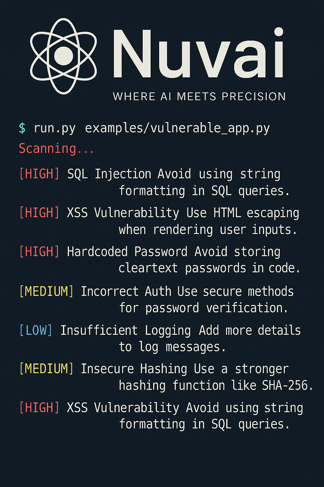

# Nuvai: Secure AI Code Scanner



**Where AI meets precision.**
Nuvai is a multi-language, AI-aware static code analysis engine that scans source code for vulnerabilities with the mindset of a seasoned penetration tester. Designed for both developers and non-technical users, Nuvai aims to make secure development accessible and intuitive.

---

## 🧠 What is Nuvai?
Nuvai is a powerful open-source tool that automatically detects security issues in source code—especially code generated by AI tools or built with No-Code/Low-Code platforms. It supports multiple languages, gives detailed recommendations, and allows saving scan reports in various formats.

> ⚠️ Nuvai is currently under active development and is being built according to ISO/IEC 27001 information security standards.

## ✨ Key Features
- ✅ Supports multiple languages: Python, JavaScript, HTML, JSX, PHP, TypeScript, C++
- 🔍 Detects vulnerabilities like:
  - Code Injection
  - XSS
  - Command Injection
  - Hardcoded secrets
  - Insecure deserialization
  - SSRF, CSRF, Path Traversal, and more
- 📦 Export scan results as: JSON, TXT, HTML, or PDF
- 🧩 Intelligent language detection (based on extension & content)
- 🔒 Built with security-first architecture (ISO 27001-inspired)
- ⚙️ CLI, API (Flask backend), and modern Web UI (React)
- 📂 Organized reports in a dedicated folder (`~/security_reports`)

---

## 📁 Project Structure
```
Nuvai/
├── assets/                  # Static assets (logo, UI visuals)
├── backend/                 # Flask backend API
│   └── server.py            # Main API server
├── config/                  # Configuration files
├── examples/                # Example vulnerable apps per language
├── frontend/                # React-based web interface (coming soon)
├── src/nuvai/               # Core scanning engine
│   ├── scanner.py           # Language dispatcher
│   ├── python_scanner.py    # Python vulnerabilities scanner
│   ├── javascript_scanner.py
│   ├── html_scanner.py
│   ├── jsx_scanner.py
│   ├── php_scanner.py
│   ├── cpp_scanner.py
│   ├── typescript_scanner.py
│   ├── scanner_controller.py
│   ├── utils.py             # Detection helpers (regex, entropy, etc.)
│   ├── config.py            # Shared constants and defaults
│   └── logger.py            # Centralized, secure logging
├── run.py                   # CLI entry point
├── update_init.py           # Auto-generate __init__.py modules
├── install.sh               # Quick setup script for backend dependencies
├── LICENSE
├── README.md                # This file
```

---

## 🚀 Getting Started
### 1. Install Dependencies (Kali / Linux / WSL)
```bash
chmod +x install.sh
./install.sh
```

### 2. Run from CLI
```bash
python3 run.py examples/vulnerable_app.py
```

### 3. Run the Web Interface (Flask backend)
```bash
source .venv/bin/activate
cd backend
python3 server.py
```

---

## 🔒 Security Principles
- Input validation and output sanitization in all modules
- Sensitive data filtering from logs
- Secure file handling and cleanup (temp uploads)
- Built-in content-based language heuristics (beyond extensions)
- Output hardening: avoids HTML/script injection in report views
- Secure logger and audit trail system
- Conforming to ISO/IEC 27001 and OWASP Top 10 guidelines

---

## 📄 Example Use Cases
- ✅ Devs scanning AI-generated code before production
- ✅ Security teams integrating with CI/CD pipelines
- ✅ Educational labs for training on vulnerability detection
- ✅ Product managers verifying code from No-Code platforms

---

## 📤 Output Example


---

## 📜 License
Licensed under the [MIT License](https://github.com/tinkerlev/Nuvai/blob/main/LICENSE)

---

## 🙌 Contributors
- Built by [Loai Eliran Deeb](https://www.linkedin.com/in/loai-deeb/)
- GitHub: [@tinkerlev](https://github.com/tinkerlev)

Want to contribute? PRs are welcome!

---

## 📅 What's Next?
- 🛠️ CI/CD integration (GitHub Actions)
- 🧠 AI-enhanced fix suggestions
- 🌐 Web UI for one-click scanning
- 🔐 Advanced policy enforcement (NIST / OWASP top 10)

Stay tuned — and secure 🛡️.